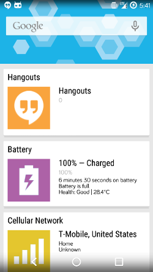

**The CM Home API**
===========================

An API for [CM Home](https://github.com/CyanogenMod/android_packages_apps_CMHome).

 [CM Home](https://github.com/CyanogenMod/android_packages_apps_CMHome) is an open-source content aggregation application built in the spirit of Google Now that can display any type of Card that is compatible [Cardslib](https://github.com/gabrielemariotti/cardslib). Right now, it displays a card for each [DashClock](https://code.google.com/p/dashclock/) extension installed on the device, but starting now, third party applications can publish cards as well!



This repository hosts both the SDK for developers to integrate and the related classes for hosting cards published from external applications implementing the SDK.

# **All About the CM Home SDK**

CM Home takes a central place on the user's device as it is directly accessible with a left swipe from the Trebuchet launcher that ships with CyanogenMOD. We expect that the best extensions will publish cards with relevant and engaging content at just the right time.

The SDK was built to allow developers to share content with as little code as possible. Each application hosts a ContentProvider that stores information about the current cards that is read by CM Home in real time as data is added.

You can view the full JavaDocs [here](http://cyanogenmod.github.io/external_cyanogen_cmhomeapi/)

## Download the SDK

The most up to date jar for the SDK is available here: [cmhome-api_v1_0.jar](releases/cmhome-api_v1_0.jar). Download and import this jar to get started.

## First Things First

Before you can publish cards, there are a few prerequisites to take care of:

1. Your application must declare the `org.cyanogenmod.launcher.home.api.FEED_PUBLISH` permission in AndroidManifest.xml:

    ```xml
    <uses-permission
        android:name="org.cyanogenmod.launcher.home.api.FEED_PUBLISH" />
    ```
    
2.  You must declare `CmHomeContentProvider` in your AndroidManifest.xml. Please note that the following attributes must be set to specific values:

    `android:name` - set this to the fully qualified class name of CmHomeContentProvider: "org.cyanogenmod.launcher.home.api.provider.CmHomeContentProvider"
    
    `android:label` - You must define a string to label this ContentProvider.
    
    `android:authorities` - This must be set to ~your package name~.cmhomeapi as in the example below.
    
    `android:readPermission` and `android:writePermission` - Must be set as in the example below.


    ```xml
    <provider android:name="org.cyanogenmod.launcher.home.api.provider.CmHomeContentProvider"
              android:label="@string/provider_name"
              android:authorities="org.cyanogenmod.launcher.home.api.sdkexample.cmhomeapi"
              android:enabled="true"
              android:exported="true"
              android:readPermission="org.cyanogenmod.launcher.home.api.FEED_READ"
              android:writePermission="org.cyanogenmod.launcher.home.api.FEED_WRITE" />
    ```

## Cards, Cards, Cards

To publish cards to CM Home, nearly everything you need is in the [CardData][1] class. [CardData][1] contains data representing a single card that can appear in CM Home. 

[CardData][1] includes many possible fields, and not all of them are required. The idea is that an extension application can publish whatever data or content they have available, and CM Home will do it's very best to find the best Card UI for the data available. At minimum, a card should have a ContentCreatedDate and a Title. More Card types will be created in the future, so publish as much data as you have, so that they will be used in rich ways within CM Home.

#### Add a New Card to CM Home

Instantiate a new [CardData][1], set the fields you are interested in, and publish!

```java
// A card about an exciting news article!
Date now = new Date();
CardData cardData = new CardData("CyanogenMod releases a sweet new SDK!", now);
cardData.setBodyText("It's pretty awesome, click to read more.");

// Create an Intent to be launched when the user clicks the Card.
Intent cardClickIntent = new Intent(Intent.ACTION_VIEW,
                                                   Uri.parse("http://www.cnn.com/articles/awesome_cm_sdk.html"));
cardData.setCardClickIntent(cardClickIntent, false);

// Publish the card for immediate display in CM Home!
// Assuming this refers to an Activity or Service
cardData.publish(this);

```

#### Update a Published Card

After you have published a card to CM Home, you can easily update it in place and publish the updates:

```java
cardData.setTitle("Breaking news! CyanogenMod just got even more awesome.");

// Still assuming this refers to an Activity or Service
cardData.publish(this);
```

That's it, now the same card from above will be updated with a new title.

#### Remove a Card

Sometimes a Card is no longer relevant, maybe the optimal time for display has passed. Or, perhaps the user has reconfigured your application to publish different cards. Just call `unpublish(Context)`:

```java
// Say goodbye!
cardData.unpublish(this);
```

#### Create Cards with Image Content

You can attach images to a [CardData][1] by creating instances of [CardDataImage][2]. These are general purpose images that can be used by the card in CM Home for display. 

Example use cases would be to display an image attached to a news article. Or, for showing images posted by a Social Media friend.

Right now, there is no upper bound, but generally CM Home cards will probably not have enough room to display more than 6 images.

Let's add an image to that article!
    
```java
// Let's pretend we have a method for this
Bitmap articleBitmap = getArticleImage();

CardDataImage image = new CardDataImage(cardData);
image.setImage(articleBitmap);
cardData.addCardDataImage(image);

// Publish that card!
cardData.publish(this);
```

If your image is retrievable with a Uri (Content, file and internet Uris accepted!), you can just pass that to [CardData][1] using [addCardDataImage][3]:

```java
cardData.addCardDataImage("http://www.cnn.com/images/cyanogenmod_rules.jpg");
cardData.publish(this);

```

#### Retrieving Your Cards

At any time, to retrieve the Cards that are currently published for your application, just call the static method of [CardData][1], [getAllPublishedCardDatas][4]:

```java
List<CardData> allTheCards = CardData.getAllPublishedCardDatas(this);
```

Now that you have the cards, feel free to update them or unpublish them as you see fit!


## Example Projects

* [CM Home SDK Example](https://github.com/mattgmg1990/CMHome-SDK-Example) - A super simple example project that just publishes test cards with buttons 

[1]: http://cyanogenmod.github.io/external_cyanogen_cmhomeapi/reference/org/cyanogenmod/launcher/home/api/cards/CardData.html "CardData"
[2]: http://cyanogenmod.github.io/external_cyanogen_cmhomeapi/reference/org/cyanogenmod/launcher/home/api/cards/CardDataImage.html "CardDataImage"

[3]: http://cyanogenmod.github.io/external_cyanogen_cmhomeapi/reference/org/cyanogenmod/launcher/home/api/cards/CardData.html#addCardDataImage(android.net.Uri) "addCardDataImage"

[4]:
http://cyanogenmod.github.io/external_cyanogen_cmhomeapi/reference/org/cyanogenmod/launcher/home/api/cards/CardData.html#getAllPublishedCardDatas(android.content.Context) "getAllPublishedCardDatas"
